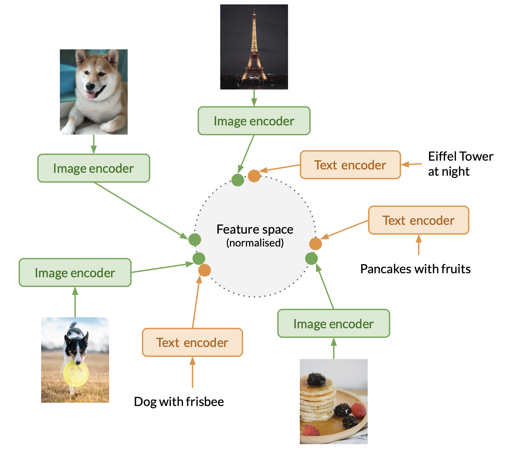

<div align="center">
  <h1>WISE Image Search Engine (WISE)</h1>

  <p>
    
    <br>
    WISE is an AI-based image search engine for efficiently searching through large collections of images.
  </p>
</div>


[[_TOC_]]

> The code and documentation contained in this repository is not stable yet for production usage. We are working on making it production ready.

<hr>


## Features

- **Natural language search** - use natural language to describe what you want to search for

  

  WISE uses a language model to understand the meaning behind your query, allowing you to flexibly describe what you are looking for. Moreover, WISE uses a vision model to understand what's being depicted in an image (i.e. it searches by image content rather than metadata such as keywords, tags, or descriptions), so the images do not need to be manually tagged or labelled with text captions.

- **Visual similarity search** - upload an image or paste an image link to find similar images

  

- **Multi-modal search** - combine images and text in your query. For example, if you upload a picture of a golden retriever and enter the text "in snow", WISE will find images of golden retrievers in snow.

  

- Searches can be performed via:

  - CLI
  - REST API
  - Web frontend

  (Note: currently the search functionality in the CLI may be missing some features.)

- Safety features
  - Specify a list of search terms that users should be blocked from searching
  - 'Report image' button allows users to report inappropriate/offensive/etc images

## How it works

WISE uses vision-language models such as OpenAI [CLIP](https://openai.com/research/clip) (specifically [OpenCLIP](https://github.com/mlfoundations/open_clip), which is an open-source implementation of CLIP trained on the [LAION](https://laion.ai/blog/laion-5b/) dataset).

A vision-language model consists of a text encoder and image encoder that have been trained together, resulting in a model that is able to map both images and text onto the same feature space. Images and/or text that have similar semantics (meanings) are placed closer together in this feature space, while unrelated images/text are placed further apart.



When you enter a text query, WISE uses the text encoder to transform the input text into a feature vector. This feature vector is compared against the feature vectors of the images in the search collection, to find the nearest neighbours (using a distance metric such as cosine distance). The vectors that are closest to the feature vector of the text query, represent the images that are most relevant to the search query.

A similar approach is used when an image is used as the query, except that the image encoder is used to encode the query, rather than the text encoder.

The [Faiss](https://github.com/facebookresearch/faiss) library is used to perform approximate nearest neighbour search.

For multi-modal queries (images + text), the feature vectors of the individual images/text that make up the query are added together, with higher weight assigned to the text query/queries. The weighted sum is then normalised and used as the query vector for the nearest neighbour search.

## Installation

### Setup virtual environment and install dependencies

We recommend using `conda` / `mamba` to set up WISE. Alternatively, if both those options don't work for you, you could try using `pip`.

#### Option 1: Installation using conda

You will need either

- [conda](https://conda.io/projects/conda/en/stable/user-guide/install/index.html) or
- [mamba](https://mamba.readthedocs.io/en/latest/installation.html)

installed on your system. We recommend you to use recent version of conda (22 or greater) / mamba (1.4+).

Please Note:

1. WISE might not work on lower versions of conda / mamba.
2. If you are using WISE on non-intel platforms, edit `environment.yml` to remove the reference to `mkl`

```bash
git clone https://gitlab.com/vgg/wise/wise.git
cd wise
conda env create -f environment.yml
conda activate wise
```

(For mamba, replace `conda` in the above command accordingly)

#### Option 2: Installation using pip

(You will need to have Python 3 and pip installed beforehand. Click [here](https://www.python.org/downloads/) to install both. We recommend using Python 3.9 or greater, and pip 22 or greater. WISE might not work on lower versions.)

```bash
git clone https://gitlab.com/vgg/wise/wise.git
cd wise
python3 -m venv env
source env/bin/activate
pip install -r requirements.txt
pip install -r torch-faiss-requirements.txt
```

## Usage

Before running the commands below, make sure you have `cd`'ed into the `wise` folder (if you haven't done so already), and activate the virtual environment by running `source env/bin/activate` (if you are using pip) or `conda activate wise` (if you are using conda).

For more details on the commands available, run

```bash
python3 wise.py --help
```

### Initialise project with a collection of images

The `init` command creates a new project. For each data source provided, features, thumbnails and metadata are extracted.

```bash
python3 wise.py init your-project-name \
  --batch-size 16 --model "ViT-L-14:laion2b_s32b_b82k" \
  --store-in /path/to/some/folder \
  --source /path/to/a/folder/of/images \
  --source /you/can/specify/multiple/sources \
  --source /path/to/a/webdataset{000..999}.tar
```

Parameters:

- `--source`: you can pass in a folder of images, or a [WebDataset](https://webdataset.github.io/webdataset/). You can also provide more than one `--source` as shown above
- `--store-in`: folder where you would like the extracted features, indices, thumbnails, and metadata to be stored. (Make sure this is on a disk with sufficient space.) If unspecified, these files will be stored within the `~/.wise/projects/project-name` folder (in your home directory)
- `--batch-size`: number of images in each batch to pass to the model. Default value: 1
- `--model`: specify an OpenCLIP model to use for extracting features (for a full list of models available, run `python3 wise.py init --help`). Default value: `ViT-B-32:openai`.
- For more details on the options available, run `python3 wise.py init --help`

### Add more images to an existing project

```bash
python3 wise.py update your-project-name \
  --batch-size 128 \
  --source "/path/to/folder/or/webdataset"
```

- For more details on the options available, run `python3 wise.py init --help`

### Create a search index based on approximate nearest neighbour search

```bash
python3 wise.py index your-project-name --index-type IndexIVFFlat
# (for exhaustive search, use --index-type IndexFlatIP)
```

- For more details on the options available, run `python3 wise.py index --help`

### Serve the web interface for the search engine

```bash
python3 wise.py serve your-project-name --index-type IndexIVFFlat
```

- For now you will need to replace the `<base href="/wikimedia/">` in `frontend/dist/index.html` with your project name, e.g. `<base href="/your-project-name-here/">`. This will be done automatically later on.
- Once the server has been started, go to http://localhost:9670/your-project-name in your browser
- You can optionally provide a query blocklist (i.e. a list of queries that users should be blocked from searching) using `--query-blocklist /path/to/blocklist.txt`
- For more details on the options available, run `python3 wise.py serve --help`

## Frontend

WISE currently has two frontends, `imgrid` and `dynamic`. When running `python3 wise.py serve`, you can either pass in `--theme-asset-dir www/imgrid` or `--theme-asset-dir www/dynamic`. If left unspecified, the `dynamic` frontend is used by default.

- `imgrid` is a simple frontend written in vanilla JavaScript and its source code is located in `www/imgrid`
- `dynamic` is built using React and TypeScript and contains additional features. The source code for this frontend is located in the `frontend` folder. The production build is located in the `frontend/dist` folder and is also symlinked in `www/dynamic`.

For more details on the `dynamic` frontend (e.g. if you want to make custom modifications to it), please see [`frontend/README.md`](frontend/README.md)

You can also develop your own frontend that interacts with the WISE backend. The backend API endpoints are defined in `api/routes.py`.

## Test

WISE contains some automated tests to verify the software's
functionality. We are still working on adding more tests for coverage

```
python -m pytest -s tests
```

## Contact

For any queries or feedback related to the WISE software, contact [Prasanna Sridhar](mailto:prasanna@robots.ox.ac.uk), [Horace Lee](mailto:horacelee@robots.ox.ac.uk) or [Abhishek Dutta](mailto:adutta@robots.ox.ac.uk).

## Acknowledgements

Development and maintenance of WISE software has been supported by the following grant: Visual AI: An Open World Interpretable Visual Transformer (UKRI Grant [EP/T028572/1](https://gow.epsrc.ukri.org/NGBOViewGrant.aspx?GrantRef=EP/T028572/1))
