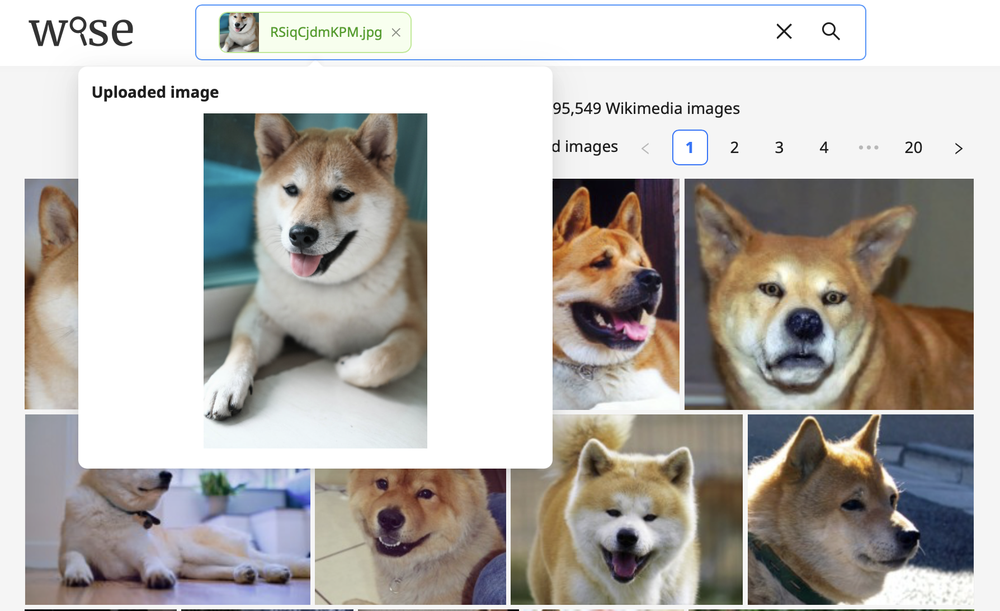

  <h1>WISE 2 - WISE Search Engine</h1>

  

    
     
    WISE is a search engine for images, videos, and audio powered by multimodal AI, allowing you to quickly and easily search through large collections of audiovisual media. You can search using natural language, an uploaded image/audio file, or a combination of these modalities.
  

## Key Features

  
<b>Natural language search</b>

  Use natural language to describe what you want to search for.
   
  
   
  WISE uses a language model to understand the meaning behind your query, allowing you to flexibly describe what you are looking for. Moreover, WISE uses a vision model to understand what's being depicted in an image (i.e. it searches by image content rather than metadata such as keywords, tags, or descriptions), so the images do not need to be manually tagged or labelled with text captions.

  
<b>Visual similarity search</b>

  Upload an image or paste an image link to find similar images:
   
  

  
<b>Multi-modal search</b>

  Combine images and text in your query. For example, if you upload a picture of a golden retriever and enter the text "in snow", WISE will find images of golden retrievers in snow.
   
  

  
<b>Various multimodal / vision-language models supported</b>

  Various models are supported including vision-language models from <a target="_blank" href="https://github.com/mlfoundations/open_clip">OpenCLIP</a> (including OpenAI CLIP) and the <a target="_blank" href="https://github.com/microsoft/CLAP">Microsoft CLAP</a> audio-language model.

  
<b>Different ways to perform searches</b>

  Searches can be performed via:
  <ul>
    <li>CLI</li>
    <li>REST API</li>
    <li>Web frontend</li>
  </ul>
  (Note: currently the search functionality in the CLI may be missing some features.)

  
<b>Safety features</b>

  <ul>
    <li>Specify a list of search terms that users should be blocked from searching</li>
    <li>'Report image' button allows users to report inappropriate/offensive/etc images (temporarily removed; will be added back soon)</li>
  </ul>

## Roadmap

We are planning on implementing the following features soon. Stay tuned!

<ul>
  <li>
    Searching on image and audio files
     
    Currently, WISE 2 only supports searching on _video files_ (on both the audio and visual stream of video files).
    Searching on images and pure audio files is not supported yet.
    Please use [WISE 1.x.x](https://gitlab.com/vgg/wise/wise/-/tree/wise-1.2.0?ref_type%253Dtags) for now if you need to search on images.
  </li>
  <li>
  Cross platform easy installation
   
  We are working on creating an easy-to-use installer which allows users to install WISE on Mac, Windows, and Linux without needing to use the command line.
  </li>
</ul>

## Documentation
The WISE open source software is developed and maintained by the
Visual Geometry Group ([VGG](https://www.robots.ox.ac.uk/~vgg/software/wise/)) at the University of Oxford.

Here are some documents for users and developers of WISE.

 - [Install](docs/Install.md) : describes the process for installing WISE
 - [User Guide](docs/UserGuide.md) : demonstrates the usage of WISE using a sample video dataset
 - Developer Resources
   - [Feature Extractor](docs/FeatureExtractor.md) : guide for creating new feature extractors in WISE
   - [Tests](docs/Tests.md) : describes the software testing process for WISE
   - [FeatureStore](docs/FeatureStore.md) : describes the data structure containing the extracted features

## Contact

Please submit any bug reports and feature requests on the [Issues page](https://gitlab.com/vgg/wise/wise/-/issues).

For any queries or feedback related to the WISE software, contact [Prasanna Sridhar](mailto:prasanna@robots.ox.ac.uk), [Horace Lee](mailto:horacelee@robots.ox.ac.uk) or [Abhishek Dutta](mailto:adutta@robots.ox.ac.uk).

## Acknowledgements

Development and maintenance of WISE software has been supported by the following grant: Visual AI: An Open World Interpretable Visual Transformer (UKRI Grant [EP/T028572/1](https://gow.epsrc.ukri.org/NGBOViewGrant.aspx?GrantRef=EP/T028572/1))
