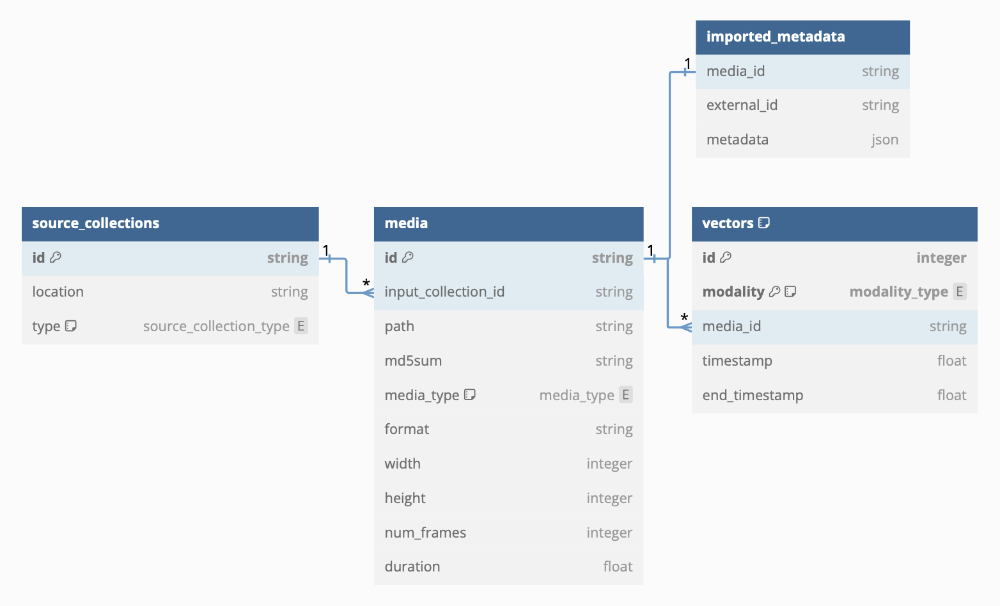

# Metadata

WISE metadata is stored in an sqlite database, located at {PROJECT_DIR}/{PROJECT_DIR}.db

WISE uses [SQLAlchemy](https://www.sqlalchemy.org/) (Core API) to interact with this database, and [Pydantic](https://docs.pydantic.dev/latest/) to parse / validate the data going into the DB.

The table structures are defined [here](../src/db/tables/__init__.py) and the validation models are defined [here](../src/data_models.py)

(Credits: @horacelee18ic)

In addition to the ones defined above, WISE stores the thumbnails as well in the `thumbnails` table. Thumbnails are explained in more detail [here](./thumbnails.md)

WISE uses the [repository pattern](https://www.cosmicpython.com/book/chapter_02_repository.html) to abstract the DB access. The CRUD methods are defined [here](../src/repository/base.py) and repository for each metadata table is instantitated [here](../src/repository/__init__.py)
