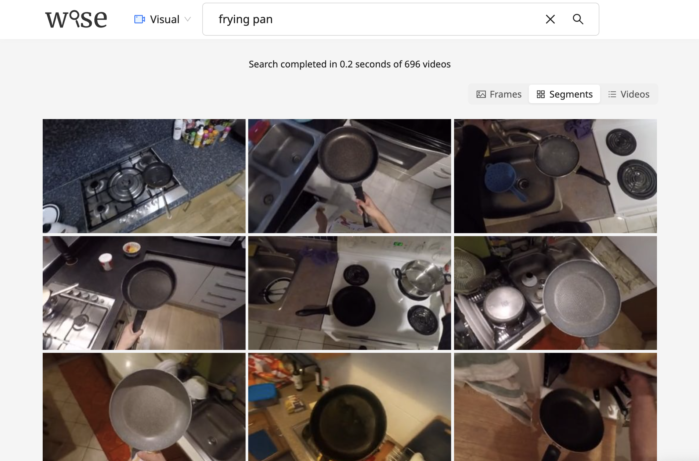

# WISE User Guide

The [Installation](Install.md) page describes the process of installing the
WISE software. This tutorial assumes that the WISE software has already been
installed.

First, we download a set of sample videos which can be used to test the
audio and visual search capabilities of WISE.

```
# We assume that the current directory contains
# the WISE software source tree.
mkdir -p wise-data/Kinetics-6
curl -sLO "https://www.robots.ox.ac.uk/~vgg/software/wise/data/test/Kinetics-6.tar.gz"
tar -zxvf Kinetics-6.tar.gz -C wise-data/Kinetics-6
```

Next, we extract visual and audio features and create a search index that will allows
us to perform audio and visual search on the video collection.

```
mkdir -p wise-projects/
python3 extract-features.py \
  --media-dir wise-data/Kinetics-6/ \
  --project-dir wise-projects/Kinetics-6/

python3 create-index.py \
  --project-dir wise-projects/Kinetics-6/
```

We can now search the video collection either using the web-based interface, or using the CLI as described below:

## Search using web-based interface

Start the web server using the command below:
```
python3 serve.py --project-dir wise-projects/Kinetics-6/
```
Once the server has been started, go to http://localhost:9670/Kinetics-6/ in your browser. This will open up a search interface like this:



- You can change some configurations, such as the port number and index type, in [config.py](../config.py)
- You can optionally provide a query blacklist/blocklist (i.e. a list of queries that users should be blocked from searching) using --query-blacklist /path/to/blacklist.txt
- For more details on the options available, run `python3 serve.py --help`


## Search using CLI
```
python search.py \
  --query "cooking" --in video \
  --query "music" --in audio \
  --topk 20 \
  --project-dir wise-projects/Kinetics-6/
```

The search results, shown below, shows that this search query is able to find the video that shows
someone cooking food with music playing in the background.

```
Searching /data/beegfs/ultrafast/home/adutta/temp/wise/Kinetics-6/ for
  [0] "cooking" in video
  [1] "music" in audio


                           Search results for "cooking" in video                            
 Rank  Filename                                         Time       Score  Original Ranks    
    0  frying-vegetables/mwkOrWZxvrU_000006_000016.mp4  0.5 - 1.5  0.218  0,1,4             
    1  frying-vegetables/mT7vy1-KP_Q_000398_000408.mp4  0.5 - 9.0  0.211  2,5,...,13,18 (9) 
    2  frying-vegetables/lUyXiF6KfgU_000296_000306.mp4  5.0 - 8.5  0.210  3,7,14,16         
    3  frying-vegetables/hxK9mej0_zw_000086_000096.mp4  0.0 - 9.5  0.208  6,15,17,19        

                           Search results for "music" in audio                           
 Rank  Filename                                         Time       Score  Original Ranks 
    0  frying-vegetables/hxK9mej0_zw_000086_000096.mp4  0.0 - 8.0  0.256  0,10           
    1  jogging/OmWoDAQM1kk_000000_000010.mp4            0.0 - 8.0  0.237  1,3            
    2  singing/vdnskiY-DRc_000023_000033.mp4            0.0 - 8.0  0.237  2,5            
    3  singing/GO5DhmRmHco_000112_000122.mp4            0.0 - 8.0  0.206  4,6            
    4  singing/arBpk6QCVFs_000064_000074.mp4            0.0 - 8.0  0.184  7,13           
    5  singing/WKSxT9T-P_U_000157_000167.mp4            0.0 - 8.0  0.183  8,18           
    6  shouting/9NdaqLe2gIs_000022_000032.mp4           0.0 - 8.0  0.181  9,11           
    7  singing/I6NDj1EcP6w_000073_000083.mp4            4.0 - 8.0  0.163  12             
    8  jogging/UQsA-W-q3oA_000002_000012.mp4            4.0 - 8.0  0.145  14             
    9  frying-vegetables/5E20wCGF6Ig_000122_000132.mp4  0.0 - 8.0  0.143  15,19          
   10  jogging/QY8RJBxbLnA_000116_000126.mp4            0.0 - 8.0  0.139  16,17          

[0]
                Search results for "cooking and music" in video and audio                
 Rank  Filename                                         Time       Score  Original Ranks 
    0  frying-vegetables/hxK9mej0_zw_000086_000096.mp4  0.0 - 9.5  0.464  0,3            

(search completed in 0.249 sec.)
```

The range value shown in the `Time` column (e.g. `0.0 - 9.5`) is obtained
by merging two or more results from the initial ranked list. The ranked
results that do not get merged are reported as a single timestamp
(e.g. `4.0`) which is same as it was in the original unmerged ranked list of
nearest neighbours.

If you want to try a large number of search queries, you can
try the WISE search console which is much faster as it needs to
load all the required assets (e.g. models) only once. Here is an
example of the same search query run in the search console.

```
$ python search.py \
  --project-dir wise-projects/Kinetics-6/

Starting WISE search console ...
Some examples queries (press Ctrl + D to exit):
  1. find cooking videos with music playing in background
     > --query "cooking" --in video --query music --in audio
  2. find videos showing train, show only top 3 results and export results to a file
     > --query train --in video --topk 3 --result-format csv --save-to-file train.csv

[0] > --query "cooking" --in video --query "music" --in audio --topk 20
                           Search results for "cooking" in video                            
 Rank  Filename                                         Time       Score  Original Ranks    
    0  frying-vegetables/mwkOrWZxvrU_000006_000016.mp4  0.5 - 1.5  0.218  0,1,4             
    1  frying-vegetables/mT7vy1-KP_Q_000398_000408.mp4  0.5 - 9.0  0.211  2,5,...,13,18 (9) 
    2  frying-vegetables/lUyXiF6KfgU_000296_000306.mp4  5.0 - 8.5  0.210  3,7,14,16         
    3  frying-vegetables/hxK9mej0_zw_000086_000096.mp4  0.0 - 9.5  0.208  6,15,17,19        

                           Search results for "music" in audio                           
 Rank  Filename                                         Time       Score  Original Ranks 
    0  frying-vegetables/hxK9mej0_zw_000086_000096.mp4  0.0 - 8.0  0.256  0,10           
    1  jogging/OmWoDAQM1kk_000000_000010.mp4            0.0 - 8.0  0.237  1,3            
    2  singing/vdnskiY-DRc_000023_000033.mp4            0.0 - 8.0  0.237  2,5            
    3  singing/GO5DhmRmHco_000112_000122.mp4            0.0 - 8.0  0.206  4,6            
    4  singing/arBpk6QCVFs_000064_000074.mp4            0.0 - 8.0  0.184  7,13           
    5  singing/WKSxT9T-P_U_000157_000167.mp4            0.0 - 8.0  0.183  8,18           
    6  shouting/9NdaqLe2gIs_000022_000032.mp4           0.0 - 8.0  0.181  9,11           
    7  singing/I6NDj1EcP6w_000073_000083.mp4            4.0 - 8.0  0.163  12             
    8  jogging/UQsA-W-q3oA_000002_000012.mp4            4.0 - 8.0  0.145  14             
    9  frying-vegetables/5E20wCGF6Ig_000122_000132.mp4  0.0 - 8.0  0.143  15,19          
   10  jogging/QY8RJBxbLnA_000116_000126.mp4            0.0 - 8.0  0.139  16,17          

[0]
                Search results for "cooking and music" in video and audio                
 Rank  Filename                                         Time       Score  Original Ranks 
    0  frying-vegetables/hxK9mej0_zw_000086_000096.mp4  0.0 - 9.5  0.464  0,3            

(search completed in 0.295 sec.)
```

To save your results to a CSV text file, you can add the `--export-csv`
flag in the search console as shown below.

```
[1] > --query "cooking" --in video --query "music" --in audio --topk 20 --result-format csv --save-to-file cooking-music.csv
saving results to file cooking-music.csv

[2] >
(press Ctrl + D to exit)
Bye

$ cat cooking-music.csv
query_id,query_text,media_type,rank,filename,start_time,end_time,score
0,"cooking",video,0,"frying-vegetables/mwkOrWZxvrU_000006_000016.mp4",0.5,1.5,0.218
0,"cooking",video,1,"frying-vegetables/mT7vy1-KP_Q_000398_000408.mp4",0.5,9.0,0.211
0,"cooking",video,2,"frying-vegetables/lUyXiF6KfgU_000296_000306.mp4",5.0,8.5,0.210
0,"cooking",video,3,"frying-vegetables/hxK9mej0_zw_000086_000096.mp4",0.0,9.5,0.208
1,"music",audio,0,"frying-vegetables/hxK9mej0_zw_000086_000096.mp4",0.0,8.0,0.256
1,"music",audio,1,"jogging/OmWoDAQM1kk_000000_000010.mp4",0.0,8.0,0.237
1,"music",audio,2,"singing/vdnskiY-DRc_000023_000033.mp4",0.0,8.0,0.237
1,"music",audio,3,"singing/GO5DhmRmHco_000112_000122.mp4",0.0,8.0,0.206
1,"music",audio,4,"singing/arBpk6QCVFs_000064_000074.mp4",0.0,8.0,0.184
1,"music",audio,5,"singing/WKSxT9T-P_U_000157_000167.mp4",0.0,8.0,0.183
1,"music",audio,6,"shouting/9NdaqLe2gIs_000022_000032.mp4",0.0,8.0,0.181
1,"music",audio,7,"singing/I6NDj1EcP6w_000073_000083.mp4",4.0,8.0,0.163
1,"music",audio,8,"jogging/UQsA-W-q3oA_000002_000012.mp4",4.0,8.0,0.145
1,"music",audio,9,"frying-vegetables/5E20wCGF6Ig_000122_000132.mp4",0.0,8.0,0.143
1,"music",audio,10,"jogging/QY8RJBxbLnA_000116_000126.mp4",0.0,8.0,0.139
0-1,"cooking and music",video and audio,0,"frying-vegetables/hxK9mej0_zw_000086_000096.mp4",0.0,9.5,0.464
```

All the subsequent queries in the search console gets completed almost
instantly because the required assets (e.g. model files) have already
been loaded into the computer memory.

## Search Using Query Sentences Stored in a File

For large scale evaluation, it is more more convenient to feed the
search queries to the WISE software from a text file. To demonstrate
this functionality, we first create a CSV file in which all the search
query sentences are stored one per line of the text file with a header
line of "query_id,query_text" as shown below.

```
$ cat queries.csv
query_id,query_text
1,cooking
2,walking
```

The header line must be present in the input CSV file. Now, we can
search using these queries as follows.

```
$ python search.py \
  --in video \
  --result-format csv \
  --save-to-file results.csv \
  --topk 5 \
  --queries-from queries.csv \
  --project-dir wise-projects/Kinetics-6/
```

The search results are exported to a csv file as shown below.

```
$ cat results.csv
query_id,query_text,media_type,rank,filename,start_time,end_time,score
1,"cooking",video,0,"frying-vegetables/mwkOrWZxvrU_000006_000016.mp4",0.5,1.5,0.218
1,"cooking",video,1,"frying-vegetables/mT7vy1-KP_Q_000398_000408.mp4",4.0,4.0,0.211
1,"cooking",video,2,"frying-vegetables/lUyXiF6KfgU_000296_000306.mp4",8.5,8.5,0.210
2,"walking",video,0,"jogging/UQsA-W-q3oA_000002_000012.mp4",2.5,9.0,0.168
2,"walking",video,1,"jogging/RpjJ3VoLFmQ_000084_000094.mp4",1.0,6.5,0.165
```
