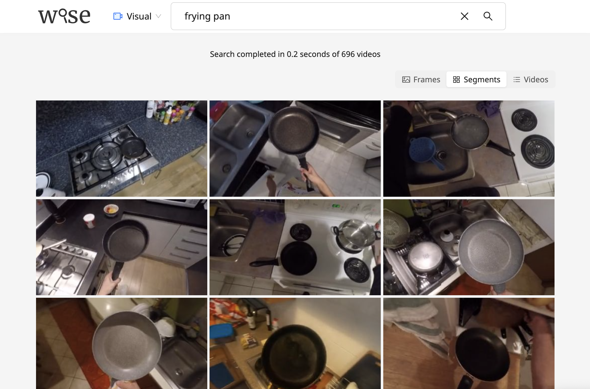

# WISE User Guide

## Step 1: Install WISE
The [Installation](Install.md) page describes the process of installing the
WISE software. This tutorial assumes that the WISE software has already been
installed.

## Step 2: Download sample videos (optional)
You can use WISE on your own folder of images and/or videos. If you do not have
one, you can download a set of sample videos which can be used to test the 
audio and visual search capabilities of WISE.

```bash
# We assume that the current directory contains
# the WISE software source tree.
mkdir -p wise-data/Kinetics-6
curl -sLO "https://thor.robots.ox.ac.uk/wise/assets/test/Kinetics-6.tar.gz"
tar -zxvf Kinetics-6.tar.gz -C wise-data/Kinetics-6
```

## Step 3: Extract features
Next, we extract visual and audio features and create a search index that will allow
us to perform audio and visual search on the video collection.

```bash
mkdir -p wise-projects/
python3 -m extract-features \
  wise-data/Kinetics-6/ \                   # input media folder 
  --project-dir wise-projects/Kinetics-6/   # WISE project folder
```
Notes:
- Replace `wise-data/Kinetics-6/` in the command above with the appropriate
  folder path if you want to use WISE on your own folder of media files. You 
  can also pass in multiple folders, separated by spaces
- A WISE project will be created in `--project-dir` - this will be used to
  store project assets such as feature vectors, indices, thumbnails, and
  metadata
- <details>
    <summary>Specify feature extraction model(s)</summary>
   
    - You can specify the feature extraction model(s) used for different media 
    types with the following optional parameters:
      - `--image-feature-id`: feature extractor used for image files
        - You can specify any OpenCLIP model here. Default: `mlfoundations/open_clip/ViT-B-16-SigLIP2-512/webli`
      - `--video-feature-id`: feature extractor used for the visual stream of video files
        - You can specify any OpenCLIP model here. Default: `mlfoundations/open_clip/ViT-B-16-SigLIP2-512/webli`
      - `--audio-feature-id`: feature extractor used for the audio stream of video files
        - Currently only the Microsoft CLAP model is supported: `microsoft/clap/2023/four-datasets`
    - To enable Face Search, pass in `--image-feature-id deepinsight/insightface/buffalo_l/_` (use `--video-feature-id ...` for video files)
    - To enable Object Search, pass in `--image-feature-id transformers/owlv2/google/owlv2-base-patch16-ensemble` (use `--video-feature-id ...` for video files)
    - Multiple feature extractors can be used for a given media type by specifying them as separate arguments, e.g., `--image-feature-id mlfoundations/open_clip/ViT-B-16-SigLIP2-512/webli --image-feature-id deepinsight/insightface/buffalo_l/_`.
  </details>
- For more details on the options available, run `python3 -m wise extract-features --help`

## Step 4: Create vector search index
```bash
python3 -m wise create-index \
  --project-dir wise-projects/Kinetics-6/  # Pass in the same project folder as above
```

- The type of search index can be customised using the `--index-type` option, with supported types being `IndexFlatIP` (default) and `IndexIVFFlat` (for faster search speeds at the cost of slightly reduced retrieval accuracy, suitable for larger projects with many images / video frames)
- For more details on the options available, run `python3 -m wise create-index --help`

## Step 5: Search

We can now search the video collection either using the web-based interface, or using the CLI as described below:

### Search using web-based interface

Start the web server using the command below:
```bash
python3 -m wise serve --project-dir wise-projects/Kinetics-6/
```
Once the server has been started, go to http://localhost:9670/Kinetics-6/ in your browser. This will open up a search interface like this:



- You can change some configurations, such as the port number and index type, in `config.py`
- For more details on the options available, run `python3 -m wise serve --help`
