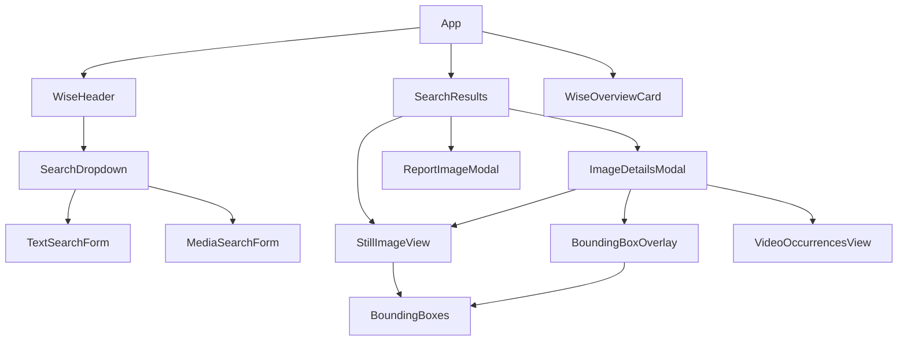

# WISE Frontend
This folder contains the source code for the frontend web-based interface, built using React and TypeScript. The production build of this frontend is located in the `dist` subfolder.

You can also develop your own frontend that interacts with the WISE backend. The backend API endpoints are defined in `api/routes.py`.

## Key Features
- Fluid and interactive user experience
- Support for visual queries (upload an image via drag and drop, or paste an image link)
- Support for compound multi-modal queries (combine multiple image and text queries together)
- Pagination for search results, with some caching
- Custom error message for blocked queries
- Allows users to report inappropriate/offensive images

## Built with
This frontend was built with [React](https://react.dev), [Ant Design](https://ant.design), and TypeScript + SASS + HTML. The [Vite.js](https://vitejs.dev) development tool was also used.

## Usage
If you would like to use this frontend without modifying the source code, simply run `python3 serve.py --project-dir {your_project_dir}` from the root directory of this repository. See the [User Guide](../docs/UserGuide.md) for more details.

If you need to modify/customise the frontend, read the section below.

## Development setup
### Prerequisites
- Make sure you have [npm](https://docs.npmjs.com/about-npm) installed beforehand. If you do not have `npm` installed, we recommend installing [nvm (Node Version Manager)](https://github.com/nvm-sh/nvm#install--update-script) first and then running `nvm install node` to install `npm` and `node`.
- `cd` into this directory and then run `npm install` to install the project dependencies

### Frontend development server
1. Make sure you have completed the prerequisite steps above, and `cd`'ed into this directory if you haven't already done so
2. Start the development server using `API_BASE_URL="http://localhost:9670/PROJECT_NAME/" npm run dev`. Once the server is running, open `localhost:5173` in your browser to access the development version of the frontend

Note: You will need to separately run the API server using `MODE="development" python3 serve.py --project-dir {your_project_dir}` from the root directory of this repository (or run `python3 serve.py --project-dir {your_project_dir}` with `mode` set to `"development"` in `config.py`).

### Production build
1. Make sure you have completed the prerequisite steps above, and `cd`'ed into this directory if you haven't already done so
2. To build the project, simply run `npm run build`. This creates a production build in the `dist` folder.

## Components

Here is a diagram showing the key components used in the frontend and the relationship between them:

